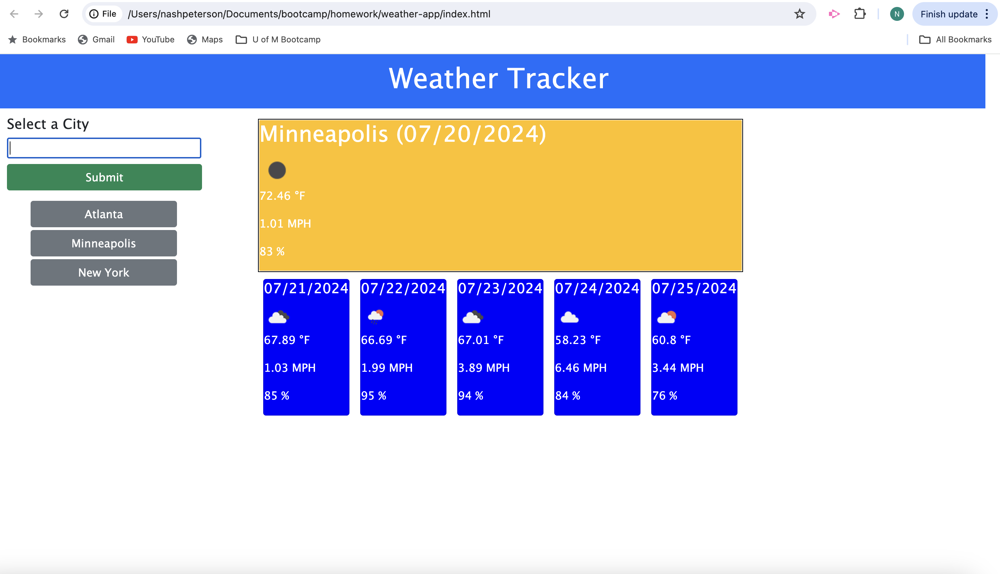

# 06 Server-side API Homework

For this assignment, I created a browser-side weather tracking application with the following functionality:

- Utilized bootstrap functionality for sizing and styling my header, div containers, form fields & dynamically created buttons/cards.
- Following the input of a city name, using URL parameters with template literal commands, the website makes dynamic api calls to OpenWeather's free Geocoding, Current Weather & Five-Day Forecast.
- Upon clicking "Submit", the user is given today's forecast in a bright orange box displaying:
    - City Name
    - Date (formatted using DayJS)
    - Temperature in Farhenheit (formatting measurement into imperial within the URL parameters) 
    - Wind Speed
    - Humidity
- Using For loops to create intervals to account for the 3-hour intervals in the API's arrays, four identical boxes display the next four day forecast (each taken at the 12pm array)
- Reading from local storage, the site dynamically creates buttons of previously submitted cities that allow the user to click on each city and display the city's current and four day forecasts.
    - Using jQuery to sort the buttons alphabetically
    - Using if statements to filter out/not create buttons for repeat city names

## Link to Deployed Version

[Click here to see the deployed version](https://teutonicted.github.io/weather-app/)

## Screenshot of the Deployed Version

